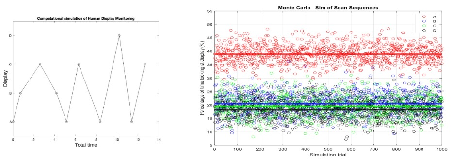

# ASEN 6216 - Human Operations Of Aerospace Vehicles

## Course Overview

This 6000 level graduate student course is aimed at examining the fundamental issues associated with human operation of aerospace vehicles. The approach is a mixture of theoretical, quantitative, and experimental, emphasizing human-centered engineering principles. Topics range from theoretical models of human information processing and decisions, physiological limitations of the human (particularly spatial orientation illusions), the design of displayand control interfaces, and the evaluation of those interfaces for human interaction with complex aerospace systems. Examples of operational applications and accidents/incidents resulting from human-automation interactions will be stressed throughout.

## Content Information

The files in this repository contain final reports for each course assignement including MATLAB scripts for calculations.

Here's a cool Image from one of the Reports:

